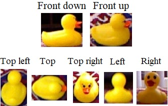

# One-Shot Next Best View for Object Recognition
The Python code for a one-shot next best view method for active object recognition. Active object recognition tries to get visual information from different viewpoints of objects to classify them better if there is uncertainty in the original recognition. In this context, next best view decides among the candidate viewpoints to provide better information for the active object recognition system for the goal of improved classification performance.

## Description
The next best view method works by dividing the current frontal viewpoint into a collection of tiles, where each peripheral tile of the image represents a side view of the current object. The following figure shows a sample situation where the frontal view is divided into nine tiles and choosing the top left would mean to look at the object from its top left next time.

<p align="center">
  
</p>

It then considers four criteria to determine the next viewpoint in only a single shot and with merely the front view of the object available. The four criteria are: histogram variance, histogram third moment, foreshortening, and classification dissimilarity of a tile compared to the frontal view. Details of these components can be found in our papers: Applied Intelligence ([pdf](./docs/AppliedIntelligence_paper.pdf) and [Springer](https://doi.org/10.1007/s10489-021-02657-z)) and VISAPP ([pdf](./docs/VISAPP_paper.pdf) or [SciTePress](https://doi.org/10.5220/0010173708410851)), which describe a recent version of the next best view method. Due to the need to compute foreshortening, the next best view method requires a depth camera to provide both color images and depth maps.

Each of the four criteria then cast votes, according to the preference they give to the tiles. The lowest ranked tile gets no votes, while others get one more vote than their less preferred one.

Our team worked on gathering a small dataset to be used specifically as a benchmark for active object recognition systems and their next best view mechanisms. This dataset is the only available dataset at the time of release to provide such a functionality for different objects, all of them in various lighting conditions and backgrounds. It was used to evaluate the next best view method and can be found in [here](https://github.com/pouryahoseini/Next-Best-View-Dataset). The following figure shows a test situation that involves two different frontal views to choose from and five side views as candidate next viewpoints.

<p align="center">
  
</p>

The next best view method can work with any classifier. In our implementation, the following classifiers are available:
* Four convolutional neural networks, including a ResNet 101
* A support vector machine with Hu moment invariants, color histogram, and/or histogram of oriented gradients (HOG) as the features with principal component analysis (PCA) as the feature reduction method
* A random forest with a bag of words feature descriptor on top of the SIFT or KAZE keypoint extractor and descriptor.

In addition, to combine the classification results of the original view and the next one, three decsion fusion techniques are implemented: Naive Bayes, Dempster-Shafer, and averaging.

The results demonstrate that while a randomly moving active object recognition mechanism generally improves classification performance, a next best view system adds to the improvements even more. On average, the performance measures, such as accuracy and F<sub>1</sub> score point to 23.1% (0.231) and 19.4% (0.194) improvements in classification performance with the next best view method, while a randomly-selecting active vision provides 17.5% and 15.1% enhancements. In the below figure, blue and red bars represent single-view and active next best view recognition performance, whereas the green bars compare other methods including the components of the next best view system. The first green bar shows the randomly-selecting active vision.

<p align="center">
  
</p>

In addition, ROC curves for different classifier types and decision fusion techniques illustrate the efficacy of next best view method compared to a single classification and randomly-selecting active vision. In the following figure, red stands for the next best view method, green for randomly-selecting active vision, and blue for no active vision. 

<p align="center">
  
</p>

## The Code
The current implementation is an improvement over the one reported in our [Applied Intelligence](./docs/AppliedIntelligence_paper.pdf) and [VISAPP 2021](./docs/VISAPP_paper.pdf) papers. Train images (for training the classifiers) should be placed under the *vision_training* directory with images of each class be placed in a separate folder with the name of the class being the folder name. The test images and depth maps should be put under the *test_set* directory. The test dataset can be found in the [Next-Best-View-Dataset](https://github.com/pouryahoseini/Next-Best-View-Dataset) repository.

To run the code, the file *main.py* should be executed. The configurations of the classifiers, fusion, test data augmentation, and evaluation are set in the *config.cfg* under the *config* directory. 

# Citation
To cite this work, you may refer to our papers published in [Applied Intelligence](https://doi.org/10.1007/s10489-021-02657-z) journal and the proceedings of [17<sup>th</sup> International Conference on Computer Vision Theory and Applications](https://doi.org/10.5220/0010173708410851).

```
@article{hoseini2021one,
  title={A one-shot next best view system for active object recognition},
  author={Hoseini, Pourya and Paul, Shuvo Kumar and Nicolescu, Mircea and Nicolescu, Monica},
  journal={Applied Intelligence},
  pages={1--20},
  year={2021},
  publisher={Springer},
  doi={10.1007/s10489-021-02657-z}
}
```

```
@conference{hoseini2021nbv,
author={Hoseini, Pourya and Paul, Shuvo Kumar and Nicolescu, Mircea and Nicolescu, Monica},
title={A Surface and Appearance-based Next Best View System for Active Object Recognition},
booktitle={Proceedings of the 16th International Joint Conference on Computer Vision, Imaging and Computer Graphics Theory and Applications - Volume 5: VISAPP},
year={2021},
pages={841-851},
publisher={SciTePress},
organization={INSTICC},
doi={10.5220/0010173708410851},
isbn={978-989-758-488-6},
issn={2184-4321}
}
```

# Developers
[Pourya Hoseini](https://github.com/pouryahoseini)

# Contact
I can be reached at hoseini@nevada.unr.edu.
